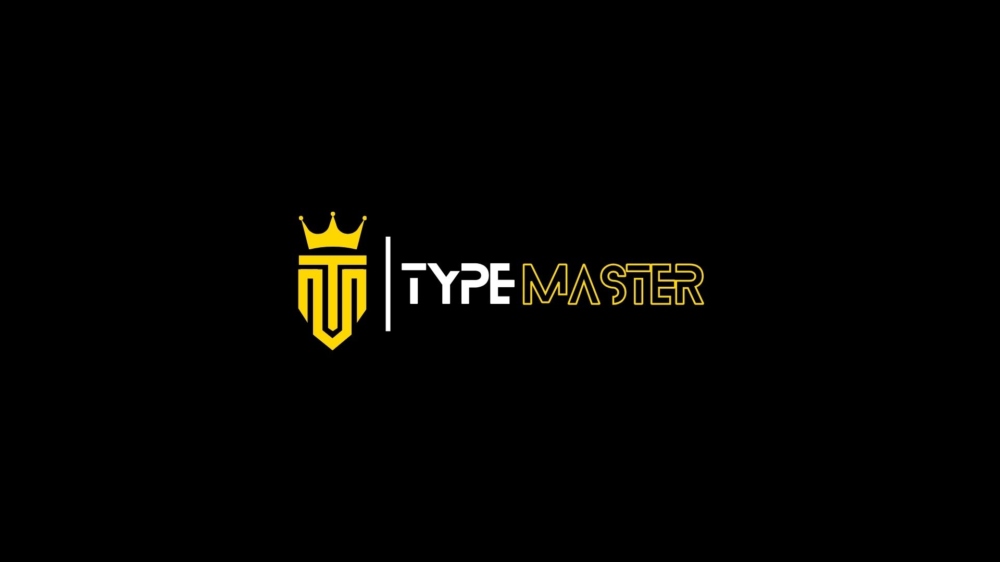

 

# About

TypeMaster is a customizable [typing test](). platform. It comes with an account system to save your typing speed history and various user-configurable features to enhance your typing experience. TypeMaster aims to mimic the natural typing experience during a typing test by displaying text prompts seamlessly and showing typed characters in real-time, offering valuable feedback on typos, speed, and accuracy.

# Features

- minimalistic design
- type what you see, see what you type
- smooth caret
- account system

# Discord comunity

On the [TypeMaster Discord server](https://discord.com/invite/SUQNj3Ch5g), we have a dedicated community for discussions, sharing experiences, and deepening knowledge about the TypeMaster typing game. Here, you can interact with fellow typing enthusiasts, share tips, and expand your network with individuals who share the same interest in improving typing skills.

# Bug report or Feature request

If you encounter a bug or have a feature request, [send us an email](mailto:typemasterteam@gmail.com), or [join the Discord server](https://discord.com/invite/SUQNj3Ch5g).
